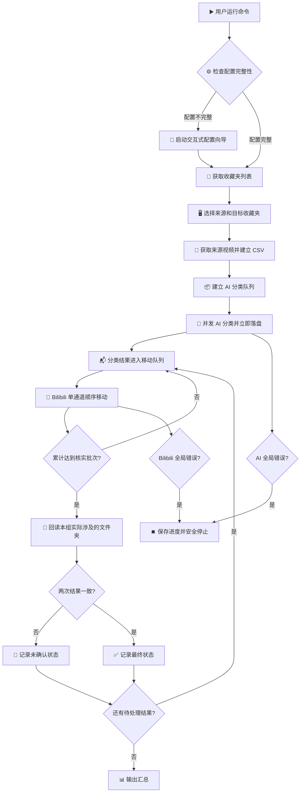

# Bilibili Favorites Classifier - 项目设计文档

嗨，你好呀！( ´ ▽ ` )ﾉ 这是为你设计的 "Bilibili Favorites Classifier" 工具的蓝图。

本文档旨在提供一个清晰、模块化且可扩展的项目结构和工作流程，深度参考了 `bilibili-ai-partition` 项目的优秀实践。

---

## 1. 📂 项目结构

为了保持代码的整洁和可维护性，我们采用 `src` 布局。整个项目结构如下所示：

```
Bilibili-Favorites-Classifier/
├── .env.example         # 配置文件示例
├── .gitignore           # Git忽略文件配置
├── main.py              # 🚀 程序主入口
├── PROJECT_DESIGN.md    # ✨ 就是本设计文档啦！
├── README.md            # 项目说明文档
├── requirements.txt     # Python依赖包列表
│
└── src/                 # 核心源代码目录
    ├── __init__.py
    ├── ai_classifier.py     # 🧠 AI分类器模块
    ├── bilibili_auth.py     # 🔑 B站认证模块
    ├── bilibili_client.py   # 📡 B站API客户端
    ├── cli.py               # 🖥️ 命令行界面模块
    ├── config_manager.py    # ⚙️ 配置管理模块
    ├── interactive_config.py # 🤝 交互式配置向导
    └── models.py            # 📦 数据模型定义
```

---

## 2. 🧩 模块功能简介

每个模块都有明确的职责，方便我们分工合作和未来的功能迭代。

*   **`main.py`**
    *   **功能**：整个应用程序的唯一入口点。
    *   **职责**：它的任务很简单，就是调用 `src/cli.py` 中的主命令，启动整个程序。

*   **`src/cli.py`**
    *   **功能**：构建用户友好的命令行界面 (CLI)。
    *   **技术栈**：使用 `click` 库处理命令和参数，使用 `rich` 库输出美观、易读的文本、表格和进度条。
    *   **职责**：负责接收用户指令，调用其他模块完成核心逻辑，并向用户展示最终的分类结果。是整个工具的“指挥官”。

*   **`src/bilibili_auth.py`**
    *   **功能**：处理B站的扫码登录认证流程。
    *   **职责**：在交互式配置流程中，负责生成二维码、检查扫码状态，并最终获取登录凭证。

*   **`src/bilibili_client.py`**
    *   **功能**：与B站后端API进行交互的客户端。
    *   **职责**：封装收藏夹读取、顺序移动、有限退避重试和实际视频 ID 回读核实。

*   **`src/ai_classifier.py`**
    *   **功能**：与大语言模型（LLM）API进行交互。
    *   **职责**：接收视频的文本信息（标题、简介），根据预设的Prompt模板构造请求，发送给AI模型（如 OpenAI 的 GPT 系列），并获取返回的分类标签。

*   **`src/config_manager.py`**
    *   **功能**：加载和管理项目配置。
    *   **职责**：安全地从 `.env` 和 `ai_config.json` 读取配置，并提供给其他模块使用。

*   **`src/models.py`**
    *   **功能**：定义核心业务的数据结构。
    *   **技术栈**：使用 `pydantic` 或 Python 内置的 `dataclasses`。
    *   **职责**：定义如 `VideoInfo`, `FavoriteFolder`, `ClassificationResult` 等数据模型，确保在不同模块间传递数据时，结构清晰、类型安全。

---

## 3. ⚙️ 核心工作流程

下面是工具从启动到完成任务的完整流程图。



**流程文字描述：**

1.  **启动**：用户在终端执行 `python main.py` 命令。
2.  **检查配置**：程序首先检查所有必需的配置（如 B站凭证、OpenAI API Key）是否齐全。
3.  **交互式配置**：如果配置不完整，`interactive_config.py` 会启动一个交互式向导，引导用户完成扫码登录和 OpenAI 的设置。
4.  **选择**：配置完成后，`bilibili_client.py` 获取用户的所有收藏夹，`cli.py` 将其以列表形式展示给用户，并让用户选择一个进行分类。
5.  **建立进度**：`cli.py` 为每个视频建立本地 CSV 记录，每个 AI 批次和每次移动后立即保存。
6.  **流水线分类与移动**：AI 使用较大批次并限制并发；分类结果进入队列后，由 Bilibili 单独的顺序执行器移动，两个阶段可以重叠运行。
7.  **核实**：每累计一个移动核实批次，只回读来源和本组实际涉及的目标收藏夹；连续两次结果一致才记为已确认。
8.  **恢复**：重新运行时自动匹配唯一的兼容进度 CSV；已确认项目不会重复提交，失败或未确认项目可以继续处理。存在多个任务时才要求重新选择。

---

## 4. 📝 配置文件 (`.env.example`)

这是我们推荐的 `.env.example` 文件内容，包含了程序运行所需的所有配置项。

```ini
# .env.example - Bilibili Favorites Classifier Configuration
# 请复制此文件为 .env 并填入你的个人信息

# --- Bilibili 登录凭证 ---
# 首次运行可通过终端向导扫码或手动输入 Cookie，程序会保存为 BILIBILI_COOKIE
BILIBILI_COOKIE=""

# --- AI 模型配置 ---
# 你的 OpenAI API Key
OPENAI_API_KEY="sk-..."

# (可选) 如果你使用代理或第三方服务, 请设置API基础地址
# 例如: https://api.openai.com/v1
OPENAI_BASE_URL=""

# (可选) 指定使用的AI模型
# 例如: gpt-4o-mini, gpt-4-turbo
OPENAI_MODEL="gpt-4o-mini"

# (可选) 自定义AI分类的Prompt模板
# {title} 和 {desc} 将会被替换为视频的实际标题和简介
# --- 运行参数 ---
REQUEST_DELAY="1.0"
MAX_RETRIES="3"
TIMEOUT="30"
PAGE_SIZE="24"
MAX_PAGES="100"
AI_BATCH_SIZE="50"
VERIFY_BATCH_SIZE="50"
AI_CONCURRENCY="4"

```
---

## 5. 本地数据清理

清理不是整理流程的自动步骤。用户明确运行 `python main.py --cleanup` 后，程序只列出并在再次确认后删除项目根目录的 `.env`、`ai_config.json` 和本工具生成的进度 CSV；模板、代码和虚拟环境保留不动。
